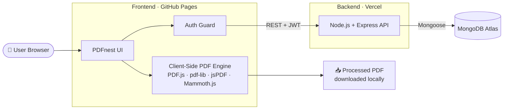
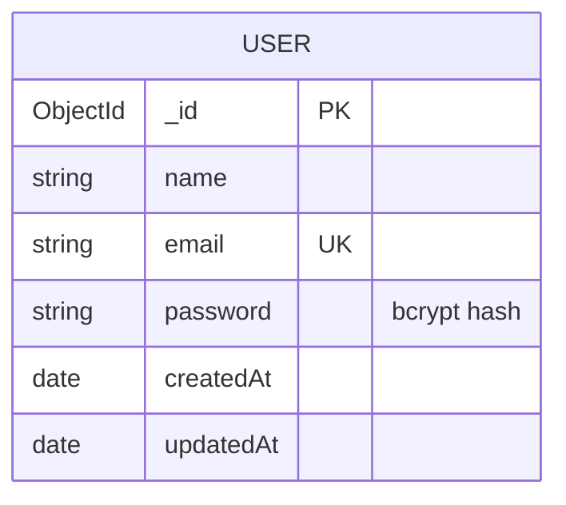
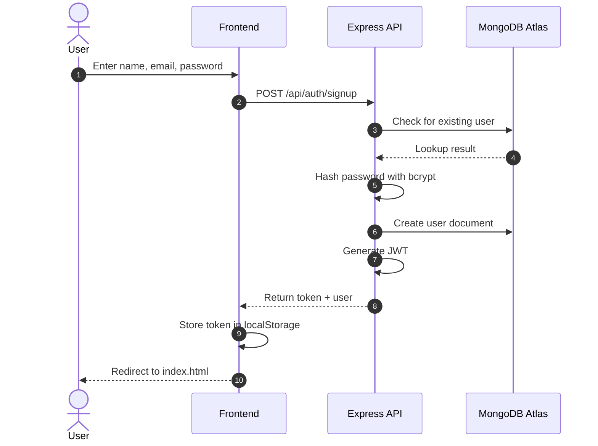
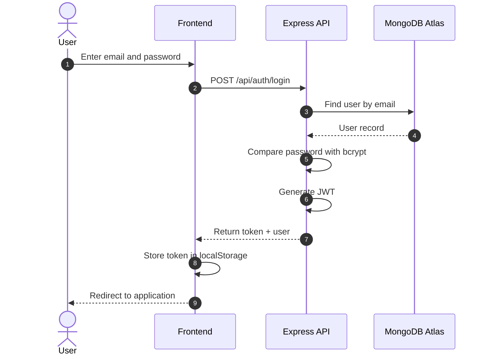
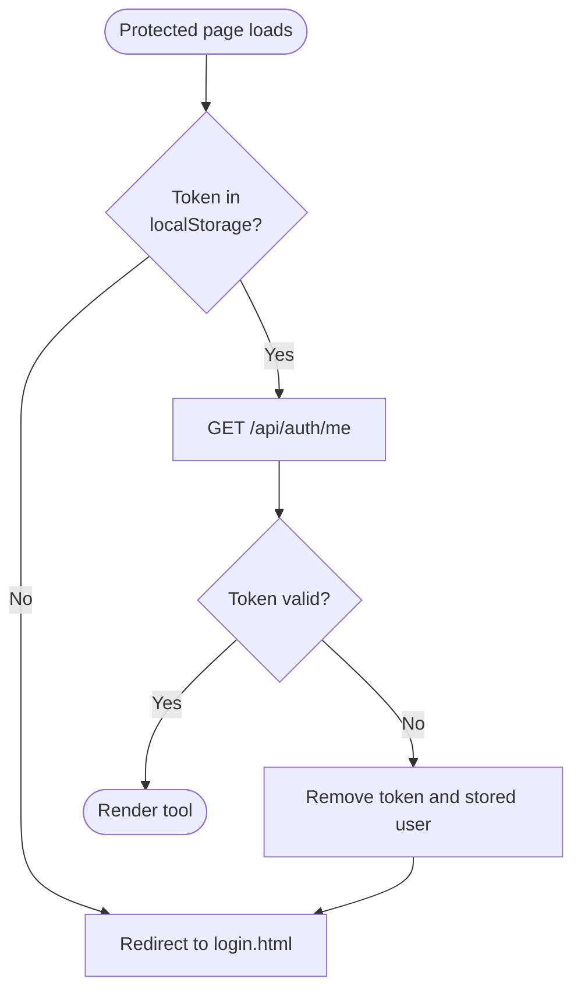
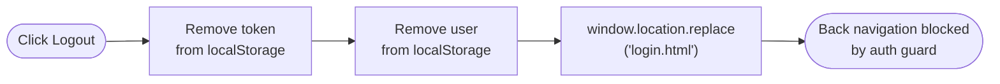
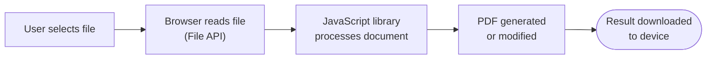
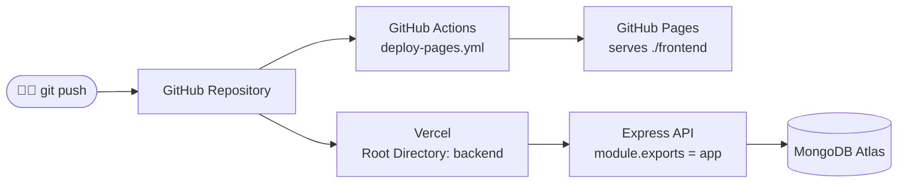

<div align="center">

# PDFnest

### Full-Stack PDF Processing Toolkit

Six powerful tools for creating, converting, merging, compressing, and editing PDFs — right in your browser.


**[🚀 Live Demo](https://satyamtiwari23.github.io/pdf_generator/)** &nbsp;·&nbsp; **[📦 Repository](https://github.com/Satyamtiwari23/pdf_generator)**

</div>

---

## 📑 Table of Contents

- [Overview](#-overview)
- [Features](#-features)
- [PDF Tools](#-pdf-tools)
- [System Architecture](#-system-architecture)
- [Authentication](#-authentication)
- [API Reference](#-api-reference)
- [Client-Side Processing](#-client-side-processing)
- [Deployment](#-deployment)
- [Project Structure](#-project-structure)
- [Tech Stack](#-tech-stack)
- [Local Development](#-local-development)
- [Security Considerations](#-security-considerations)
- [Known Limitations](#-known-limitations)
- [Roadmap](#-roadmap)
- [Author](#-author)
- [License](#-license)

---

## 📌 Overview

PDFnest is a browser-based PDF toolkit that puts essential document utilities behind a secure, authenticated interface. It is built around two core principles:

1. **Secure user authentication** — JWT-based sessions with bcrypt-hashed passwords.
2. **Client-side document processing** — PDF work happens locally in the browser using JavaScript libraries.

The backend is responsible only for authentication and user management. **Files are never uploaded to the server** for any of the implemented tools, so there is no server-side file storage to maintain or secure.

---

## ✨ Features

| Area | Highlights |
| --- | --- |
| 🔐 **Authentication** | Registration, login, logout, JWT verification, bcrypt password hashing, MongoDB-persisted users |
| 🛡️ **Route Protection** | Auth guard on every tool page, automatic token validation, browser-history handling after logout |
| 📄 **PDF Tools** | Six client-side tools for creating, converting, merging, compressing, and editing documents |
| 🔒 **Privacy** | PDFs are processed entirely in the browser and never leave the user's device |
| 🎨 **Interface** | Responsive layout, light/dark themes, drag-and-drop uploads, toast notifications, profile dropdown |

---

## 📄 PDF Tools

| # | Tool | Description | Powered by |
| :-: | --- | --- | --- |
| 1 | **Content to PDF** | Convert written or pasted text into a paginated PDF | jsPDF |
| 2 | **Images to PDF** | Combine multiple images into a single PDF | jsPDF |
| 3 | **Merge PDFs** | Join multiple PDF files into one document | pdf-lib |
| 4 | **Compress PDF** | Reduce file size by rendering pages as compressed images | PDF.js, jsPDF |
| 5 | **Word to PDF** | Convert `.docx` files into PDF | Mammoth.js, jsPDF |
| 6 | **Edit PDF** | Add and position text on existing PDFs | PDF.js, pdf-lib |

<details>
<summary><b>Detailed feature list per tool</b></summary>

<br/>

**1. Content to PDF**
- Text input with structured PDF generation
- Automatic pagination
- Fully client-side processing

**2. Images to PDF**
- Multiple image upload with drag and drop
- Image ordering
- Page size selection
- Portrait / Landscape orientation, plus automatic orientation matching

**3. Merge PDFs**
- Multiple PDF selection
- Drag-and-drop file ordering
- File removal
- PDF validation before merging

**4. Compress PDF**
- PDF validation
- Low / Medium / High quality compression levels
- Original vs. compressed size comparison
- Download of the compressed file

> **Implementation note:** Compression rasterizes each page into a JPEG image. Depending on the source file, selectable text and vector information may not be preserved. This approach works best for scan-heavy and image-heavy PDFs.

**5. Word to PDF**
- `.docx` upload and parsing
- Heading, paragraph, list, and basic table support
- Page size and font size selection

> The converter focuses on document content rather than reproducing every advanced Microsoft Word formatting feature.

**6. Edit PDF**
- PDF upload and page-by-page preview
- Text placement, text size selection, and text box editing
- Text removal
- Export of the edited PDF

</details>

---

## 🏗️ System Architecture

PDFnest uses a separated frontend/backend architecture. The frontend handles the UI and all PDF processing; the backend handles authentication only.



### Layer Responsibilities

| Layer | Hosted on | Responsibilities |
| --- | --- | --- |
| **Frontend** | GitHub Pages | UI, authentication forms, auth guard, PDF rendering / generation / manipulation, theme management, profile interface |
| **Backend** | Vercel | User registration and login, JWT generation and validation, user lookup, MongoDB communication |
| **Database** | MongoDB Atlas | Persistent storage of registered users |

> The backend does **not** process, receive, or store user PDF files.

### Data Model



---

## 🔐 Authentication

PDFnest uses stateless JWT authentication. Passwords are hashed with bcrypt before storage, and the issued token is kept in the browser's `localStorage`.

### Signup Flow



### Login Flow



### Authentication Guard

Every protected page loads `auth-guard.js`, which verifies the session before the tool is rendered.



**Protected pages:** `index.html` · `text-to-pdf.html` · `images-to-pdf.html` · `merge-pdf.html` · `compress-pdf.html` · `edit-pdf.html` · `word-to-pdf.html`

The guard also prevents already-authenticated users from returning to the login and signup pages.

### Logout Flow



Logout uses `window.location.replace()` instead of normal navigation, so the authenticated page is not added as a new history entry. If the user navigates back anyway, the auth guard acts as a second layer of protection.

---

## 🌐 API Reference

All authentication endpoints are served by the Express backend.

### `POST /api/auth/signup`

Create a new account.

**Request**
```json
{
  "name": "John Doe",
  "email": "john@example.com",
  "password": "password123"
}
```

**Response**
```json
{
  "token": "JWT_TOKEN",
  "user": {
    "id": "USER_ID",
    "name": "John Doe",
    "email": "john@example.com"
  }
}
```

### `POST /api/auth/login`

Authenticate an existing user.

**Request**
```json
{
  "email": "john@example.com",
  "password": "password123"
}
```

**Response**
```json
{
  "token": "JWT_TOKEN",
  "user": {
    "id": "USER_ID",
    "name": "John Doe",
    "email": "john@example.com"
  }
}
```

### `GET /api/auth/me`

Return the currently authenticated user.

**Headers**
```http
Authorization: Bearer <JWT_TOKEN>
```

**Response**
```json
{
  "user": {
    "id": "USER_ID",
    "name": "John Doe",
    "email": "john@example.com"
  }
}
```

### `GET /`

Backend health check.

**Response**
```json
{
  "status": "OK",
  "message": "PDFnest backend server is running"
}
```

---

## 🖥️ Client-Side Processing

A key architectural decision in PDFnest is that document processing happens locally in the user's browser.



This keeps the backend lightweight, avoids any server-side file storage, and means user documents never leave their device.

### Libraries

| Library | Purpose |
| --- | --- |
| **PDF.js** | Reading, validating, and rendering PDF pages in the browser |
| **pdf-lib** | Merging PDFs, editing documents, adding text |
| **jsPDF** | Generating PDFs — text, image, Word, and compressed output |
| **Mammoth.js** | Reading `.docx` files and extracting headings, paragraphs, lists, and basic tables |

---

## 🚀 Deployment

The frontend and backend are deployed independently on separate platforms.



| Component | Platform | Details |
| --- | --- | --- |
| **Frontend** | GitHub Pages | Deployed by a GitHub Actions workflow that publishes only the `./frontend` directory |
| **Backend** | Vercel | Project root directory is set to `backend`; the Express app is exported via `module.exports = app`, so no `app.listen()` is required |
| **Database** | MongoDB Atlas | Managed cloud database |

### Environment Variables

The backend requires the following variables:

| Variable | Description |
| --- | --- |
| `MONGO_URI` | MongoDB Atlas connection string |
| `JWT_SECRET` | Secret key used to sign and verify JWTs |

The `.env` file is excluded from version control via `.gitignore`. Credentials must never be committed to the repository.

---

## 📁 Project Structure

```text
pdf_generator/
├── frontend/
│   ├── index.html              # Dashboard
│   ├── login.html
│   ├── signup.html
│   ├── auth-guard.js           # Route protection
│   ├── theme.js                # Light / dark theme
│   ├── style.css               # Shared design system
│   ├── text-to-pdf.html
│   ├── images-to-pdf.html
│   ├── merge-pdf.html
│   ├── compress-pdf.html
│   ├── edit-pdf.html
│   ├── word-to-pdf.html
│   └── images/
├── backend/
│   ├── server.js               # Express API
│   ├── package.json
│   └── .env                    # Not committed
├── .github/
│   └── workflows/
│       └── deploy-pages.yml    # Frontend CI/CD
├── .gitignore
└── README.md
```

### Frontend Components

| File | Responsibility |
| --- | --- |
| `index.html` | Dashboard with branding, theme toggle, user profile, logout, and tool cards |
| `login.html` | Email/password login, JWT storage, error handling, redirect |
| `signup.html` | Account creation (name, email, password), JWT storage, redirect |
| `auth-guard.js` | Checks token existence, validates it with the backend, redirects unauthenticated users, keeps authenticated users out of login/signup |
| `theme.js` | Light/dark mode, persisted in `localStorage` under the `pdfnest-theme` key |
| `style.css` | Layout, cards, buttons, forms, auth UI, tool interfaces, themes, responsive design, profile dropdown, navigation, toast notifications |

---

## 📊 Tech Stack

| Layer | Technology |
| --- | --- |
| **Frontend** | HTML5, CSS3, JavaScript |
| **Typography** | Plus Jakarta Sans |
| **PDF Generation** | jsPDF |
| **PDF Rendering** | PDF.js |
| **PDF Manipulation** | pdf-lib |
| **Word Processing** | Mammoth.js |
| **Backend** | Node.js, Express.js |
| **Database** | MongoDB Atlas, Mongoose |
| **Authentication** | JSON Web Tokens, bcryptjs |
| **Frontend Hosting** | GitHub Pages |
| **Backend Hosting** | Vercel |
| **CI/CD** | GitHub Actions |
| **Version Control** | Git, GitHub |

**Backend packages:** `express` · `mongoose` · `cors` · `bcryptjs` · `jsonwebtoken` · `dotenv`

**Frontend libraries** are loaded through CDN: jsPDF, pdf-lib, PDF.js, Mammoth.js.

---

## 🛠️ Local Development

**1. Clone the repository**

```bash
git clone https://github.com/Satyamtiwari23/pdf_generator.git
cd pdf_generator
```

**2. Install backend dependencies**

```bash
cd backend
npm install
```

**3. Configure environment variables**

Create `backend/.env`:

```env
MONGO_URI=your_mongodb_connection_string
JWT_SECRET=your_jwt_secret
```

**4. Run the backend**

```bash
node server.js
```

**5. Run the frontend**

The frontend is static HTML/CSS/JS. Serve the `frontend/` directory with any static file server, and point the API base URL in the frontend code to your local backend.

---

## 🔒 Security Considerations

| Mechanism | Description |
| --- | --- |
| **Password hashing** | Passwords are hashed with bcrypt before being stored in MongoDB — never saved as plaintext |
| **JWT authentication** | The backend issues signed JWTs after successful login; protected requests send `Authorization: Bearer <token>` |
| **Token verification** | JWT signatures are verified server-side using `JWT_SECRET` |
| **Protected routes** | `auth-guard.js` blocks unauthenticated access to every tool page and validates the token with `GET /api/auth/me` |
| **Secret management** | Database credentials and the JWT secret live in environment variables, not in source code |
| **Client-side privacy** | PDFs are processed locally in the browser; the backend is never used as file storage |

### Authentication Test Coverage

The auth system was tested against the following scenarios:

- New user registration
- Duplicate email registration
- Valid login
- Invalid password
- Invalid email
- Logout
- Direct access to protected pages
- Invalid JWT
- Missing JWT
- Browser back navigation after logout
- Authenticated access to PDF tools

---

## ⚠️ Known Limitations

| Area | Limitation |
| --- | --- |
| **PDF Compression** | Pages are rasterized to JPEG, which can cause rasterized text, loss of selectable text, loss of vector information, and quality changes depending on the compression level |
| **Word Conversion** | Focuses on content extraction; advanced formatting, complex layouts, some images, advanced tables, and specialized Word elements may not be reproduced exactly |
| **PDF Editing** | Supports adding text, choosing text size, removing added text, and exporting — it is not a full professional PDF editor |

---

## 🔮 Roadmap

**Authentication & Security**
- [ ] Google / GitHub OAuth
- [ ] Password reset
- [ ] Email verification
- [ ] Refresh token architecture
- [ ] Rate limiting
- [ ] Security headers
- [ ] Improved API validation

**PDF Features**
- [ ] Page deletion and rotation
- [ ] PDF splitting
- [ ] PDF watermarking
- [ ] PDF signing
- [ ] More advanced PDF editing
- [ ] Compression that preserves selectable text
- [ ] Better Word formatting preservation

**Product & Engineering**
- [ ] User dashboard and PDF history
- [ ] File size limits
- [ ] Automated testing
- [ ] Improved accessibility
- [ ] Progressive Web App (PWA) support

---

## 🎯 Project Goals

PDFnest was built to demonstrate practical, end-to-end implementation of:

- Full-stack web architecture with frontend/backend separation
- REST API development
- JWT authentication and password hashing
- MongoDB integration
- Client-side document processing with browser APIs
- PDF manipulation
- Responsive frontend development
- Cloud deployment with GitHub Actions

---

## 👨‍💻 Author

**Satyam Tiwari**
B.Tech — Information Technology

Interests: Full-Stack Development · AI & Machine Learning · Web Development · Software Engineering

[](https://github.com/Satyamtiwari23)

---

## 📜 License

This project is intended for educational and portfolio purposes.
